  

<h1 align="center">Hi, I am Peme969 </h2>
  <h3 align="center">A passionate Junior developer from the USA 🇺🇸</h3>

  

## Featured Projects:
<table>
  <tr>
    <td>
      
    </td>
    <td>
      
    </td>
  </tr>
  <tr>
    <td>
      
    </td>
    <td>
      
    </td>
  </tr>
  <tr>
    <td>
      
    </td>
    <td>
      
    </td>
  </tr>
  <tr>
    <td>
      
    </td>
    <td>
      
    </td>
  </tr>
  <tr>
    <td>
      
    </td>
    <td>
      
    </td>
  </tr>
</table>

## Connect with me:

## Languages and Tools :octocat:
I am pretty much fluent in some and still learning others 😁

                

  
  

___________

If you have any questions or better advice, please [email me](https://mail.google.com/mail/u/0/?fs=1&tf=cm&to=me@peme969.dev)

